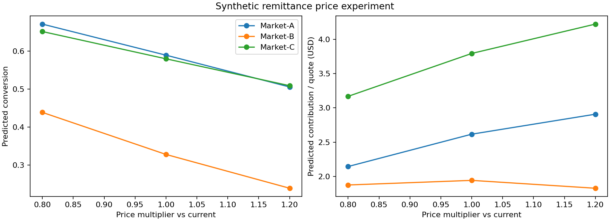

# Remittance Pricing: Elasticity and Contribution Trade-offs

> Independent portfolio simulation. All data and numerical results are synthetic. No company data, proprietary code or internal methods are included.

## Business question

A fictional cross-border payments provider needs to choose corridor-specific prices while balancing conversion, customer affordability and immediate contribution. Should it lower, keep or raise the effective price?

This demonstrates quote-grain metric design, price-response modeling, randomized experimentation, contribution economics, segment standardization, uncertainty and recommendations within observed price support.

## Quick start

Python 3.12 is recommended (the version used for verification). Run from this repository's directory:

```bash
python -m venv .venv
source .venv/bin/activate
pip install -r requirements.txt
python run.py
python -m unittest discover -s tests
```

On Windows use `.venv\Scripts\activate` to activate the environment. Data, analysis outputs and charts are already included so you can inspect the case without installing dependencies. Running the script recreates them with a fixed seed. Internet is needed only to install dependencies. For tightly reproducible environments see `VERIFICATION.md` for the versions used in the supplied run; `requirements.txt` allows compatible versions.

## Design and methods

- 24,000 independent synthetic quotes across three fictional corridors, three send amounts and new/returning users.
- Randomized low/current/high prices; one quote per customer. Total effective price = fee + principal × spread bps / 10,000, all in USD.
- Separate logit model per corridor, adjusting for customer tenure and send amount. Price is measured as percent of send amount.
- 75% training / 25% validation. Eighty customer-row bootstrap refits produce pointwise price-slope intervals.
- Standardize candidate scenarios to training current-arm customers. Choose among observed multipliers subject to a maximum modeled 3 percentage point conversion decline.
- Held-out calibration and selected-arm observed metrics; prospective confirmatory test remains necessary.

## Results and interpretation

Read [the generated business memo](outputs/decision_memo.md), [machine-readable metrics](outputs/summary.json) and [data dictionary](DATA_DICTIONARY.md). All numerical outcomes are from the synthetic environment. Report intervals and limitations alongside estimates.



## Repository map

- `run.py`: data generation, estimation, diagnostics, SQL execution and reporting.
- `data/`: generated sample data; primary table `quotes.csv`.
- `sql/`: executable SQLite metric queries, also useful as warehouse query examples.
- `notebooks/walkthrough.ipynb`: guided analysis and reflection; Jupyter is optional and is not a pipeline dependency.
- `outputs/`: CSV tables, summary JSON, decision memo, chart and generated SQLite database.
- `tests/`: data and methodological invariant checks.
- `.github/workflows/verify.yml`: rerun and checks on GitHub pushes/PRs.
- `DATA_POLICY.md`: provenance and publication boundaries.


## Extensions

This is a runnable first version. The decision memo lists domain-specific next steps. For a stronger final portfolio, add your own interpretation, sensitivity analysis, a genuine error audit and a short walkthrough video. Favor improvements that answer a business question over additional tools with no decision value.
